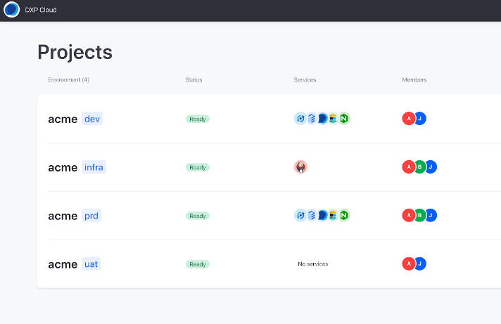
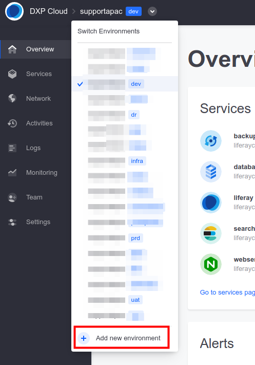
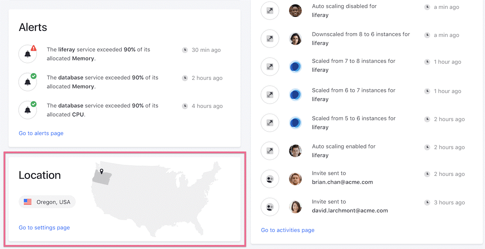
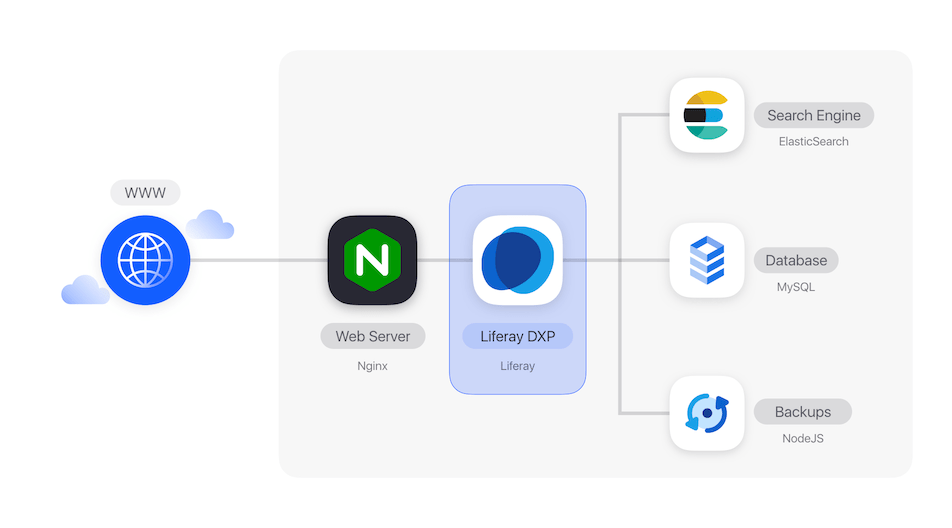

# Initial Setup Overview

Launch your projects with Liferay DXP Cloud, an enterprise cloud platform that simplifies project management, deployment, and evolution, so you can deliver amazing applications with Liferay DXP.

To get started, verify all essential provisions (i.e., Environments, Services, and related accounts) are in place and ready for development.

- [Initial Setup Emails:](#initial-setup-emails) Check the email account associated with your DXP Cloud subscription for initial setup emails.
- [Logging in:](#logging-in) Log into Liferay DXP Cloud, GitHub, and Jenkins.
- [Verifying Setup:](#verifying-setup) Verify Environments and Services have been successfully provisioned and deployed.

## Initial Setup Emails

Initial administrators should receive a DXP Cloud onboarding email, GitHub email, and email invitations for each purchased DXP Cloud Environment.

- DXP Cloud Onboarding Email: the onboarding email provides necessary credentials for accessing Jenkins and Liferay DXP Cloud on Non-Production Environments, as well as steps for how to get started with DXP Cloud.
- DXP Cloud Environment Invitations: each Environment invitation grants access to a single purchased DXP Cloud Environment. Be sure to accept all Environment invitations to gain access.
- Github Email: after following instructions in the DXP Cloud onboarding email, users will receive a GitHub email invitation to their provisioned GitHub repository. See [Logging into GitHub](#logging-in-to-github) below for more information.

## Logging In

Liferay DXP Cloud functionalities depend on users logging into the DXP Cloud Console, GitHub, and Jenkins.

### Logging into the DXP Cloud Console

Returning users can [log into the DXP Cloud Console](https://console.liferay.cloud/login) using their existing accounts. New users will need to [create an account on DXP Cloud](https://console.liferay.cloud/signup?undefined) using the email account associated with the DXP Cloud subscription.

After logging in, users are directed to the DXP Cloud Console [home page](https://console.liferay.cloud/projects). From here, users can manage Environments and Deployments.



Administrators can also invite other team members to project Environments. See [Team Collaboration & Access Control](https://learn.liferay.com/dxp-cloud-latest/manage-and-optimize/team-collaboration-and-access-control.html) for more information.

### Logging into GitHub

New DXP Cloud projects are provisioned a temporary GitHub repository hosted in the `dxpcloud` organization. To gain access to your new project repository, follow instructions in the DXP Cloud onboarding email and accept the subsequent GitHub collaboration invitation.

Once accepted, locate your provisioned project repository by logging into your associated GitHub account and searching `dxpcloud` in the 'Your teams' search box.


```important::
If there is no dxpcloud/{project_name} team returned, please contact the Liferay Support team.
```

The provisioned repository is temporary and should be used as a template for a team’s separate private DXP Cloud development repository. See [Configuring Your GitHub Repository](https://learn.liferay.com/dxp-cloud-latest/getting-started/configuring-your-github-repository.html) for how to transfer the provisioned repository to a private GitHub repository.

```note::
   Using an alternative hosting service? See how to configure your [Bitbucket](https://learn.liferay.com/dxp-cloud-latest/getting-started/configuring-your-bitbucket-repository.html) or [GitLab](https://learn.liferay.com/dxp-cloud-latest/getting-started/configuring-your-gitlab-repository.html) repositories.
```

### Logging into Jenkins

Jenkins is a common automation server used for application testing and comes pre-installed in your DXP Cloud Infrastructure (*infra*) Environment. To log into Jenkins:

1. Log into the DXP Cloud Console.
1. Navigate to *infra* Environment.
1. Click *Services* in the left menu.
1. Select *ci* service.
1. Click the Jenkins web page URL (e.g., ci-{project_id}-infra.lfr.cloud) to access the Jenkins login page.
1. Enter your Jenkins login credentials provided in your initial onboarding email.

```note::
   Your Jenkins login credentials are also listed under *Environment Variables* in the *ci* service page.
```


See [Continuous Integration](https://learn.liferay.com/dxp-cloud-latest/platform-services/continuous-integration.html) for more information about Jenkins.

## Verifying Setup

Before beginning deployment in Liferay DXP Cloud, verify that Environments and Services have been successfully provisioned and deployed.

### Verifying Environments

Environments hold all the necessary components, or Services, needed to run DXP in the cloud. Verify all purchased Environments are listed in the DXP Cloud Console [home page](https://console.liferay.cloud/projects) under *Projects*.


If any Environments are missing after all invitations have been accepted, please contact the Liferay Support team.



See [Understanding DXP Cloud Environments](https://learn.liferay.com/dxp-cloud-latest/getting-started/understanding-dxp-cloud-environments.html?highlight=location) for more information.

### Verifying Environment Locations

The Environment's location is where its data center is located. Before beginning deployment in a DXP Cloud Environment, verify its location is accurate.

The Environment location can be found in either the Environment *Overview* page, or *Settings* page.



```important::
   If the Environment location does not match the location requested by your team, please contact the Liferay Support team.
```

### Verifying Cloud Stack Services

The DXP Cloud stack consists of 5 default services: webserver (Nginx), liferay (Liferay DXP), search (ElasticSearch), database (MySQL), and backup (NodeJS).



To verify the default DXP Cloud stack services are properly deployed:

1. Access the *dev* Environment from the DXP Cloud Console.
1. Navigate to the *Services* page.


When properly deployed, the status of all 5 default Cloud Stack Services should be 'Ready'.

See [Platform Services](https://learn.liferay.com/dxp-cloud-latest/platform_services.html) for more information about these services.

## Additional Information

- [Configuring Your GitHub Repository](https://learn.liferay.com/dxp-cloud-latest/getting-started/configuring-your-github-repository.html)
- [Understanding DXP Cloud Environments](https://learn.liferay.com/dxp-cloud-latest/getting-started/understanding-dxp-cloud-environments.html?highlight=location)
- [Logging into Your DXP Cloud Services](https://learn.liferay.com/dxp-cloud-latest/getting-started/logging-into-your-dxp-cloud-services.html)