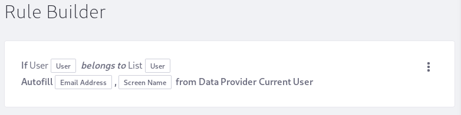

# Autofill a User's Information

Once Form builders discover the REST Data Provider and the Autofill rule, an extremely common question is _how do I get the logged-in User's information (screen name, email, etc) to autofill it in Forms fields?_ There are two ways using the out of the box Forms functionality.

## Example 1: Populating Text Fields with the Current User's Data 
```json
{
  "agreedToTermsOfUse": true,
  "comments": "",
  "companyId": "20097",
  "contactId": "20127",
  "createDate": 1616427054947,
  "ctCollectionId": "0",
  "defaultUser": false,
  "emailAddress": "test@liferay.com",
  "emailAddressVerified": true,
  "externalReferenceCode": "",
  "facebookId": "0",
  "failedLoginAttempts": 0,
  "firstName": "Test",
  "googleUserId": "",
  "graceLoginCount": 0,
  "greeting": "Welcome Test Test!",
  "jobTitle": "",
  "languageId": "en_US",
  "lastFailedLoginDate": null,
  "lastLoginDate": 1617896985488,
  "lastLoginIP": "127.0.0.1",
  "lastName": "Test",
  "ldapServerId": "-1",
  "lockout": false,
  "lockoutDate": null,
  "loginDate": 1617909123209,
  "loginIP": "127.0.0.1",
  "middleName": "",
  "modifiedDate": 1617909123210,
  "mvccVersion": "23",
  "openId": "",
  "portraitId": "0",
  "reminderQueryAnswer": "test",
  "reminderQueryQuestion": "what-is-your-father's-middle-name",
  "screenName": "test",
  "status": 0,
  "timeZoneId": "UTC",
  "userId": "20125",
  "uuid": "11f157b0-4d0d-adbc-61e3-b2e571b21447"
}
```

First create a REST Data Provider instance using Liferay's `get-current-user` endpoint:

1. Enable data provider [access to the local network.](./using-the-rest-data-provider-to-populate-form-options.md#enabling-access-to-data-on-the-local-network)
1. In the Site Menu, go to _Content & Data &rarr; Forms_ then click the _Data Providers_ tab.
1. Create a new REST Data Provider with the following settings:
   - **Name:** `Current User`
   - **URL:** `http://localhost:8080/api/jsonws/user/get-current-user`
   - Set the User Name
   - Set the Password.
   - Configure an output:
      - **Label:** `Email Address`
      - **Path:** `$.emailAddress`
      - **Type:** `Text`
   - Configure a second output:
      - **Label:** `Screen Name`
      - **Path:** `$.screenName`
      - **Type:** `Text`
1. _Save._

Now create a form with fields to autofill from the data provider's outputs: 

1. Go to _Content & Data &rarr; Forms_ and click the Add button to create a new form.
1. Add a Text field named _Email Address_.
1. Add a Text field for the _Screen Name_.
1. Go to the Rules tab and create a new rule:
   - Add a condition: 
   >  _If_ **User** _Belongs to_ **User**
   - Add the action:
   > _Do_ **Autofill** _from Data Provider_ **Current User**
   > _Email Address_ &rarr; **Email Address**
   > _Screen Name_ &rarr; **Screen Name**
   
1. Save the rule.
1. Publish the form.
1. With any logged-in User, go to the published form and verify the data is being auto-populated correctly.

## Example 2: Auto-Completed Email Address, Autofilled Screen Name 

Create a REST Data Provider instance to provide the 

1. Enable data provider [access to the local network.](./using-the-rest-data-provider-to-populate-form-options.md#enabling-access-to-data-on-the-local-network)
1. In the Site Menu, go to _Content & Data &rarr; Forms_ then click the _Data Providers_ tab.
1. Create a new REST Data Provider with the following settings:
   - **Name:** `Get Email Addresses`
   - **URL:** `http://localhost:8080/api/jsonws/user/get-company-users/company-id/20101/start/-1/end/-1`
   - Set the User Name
   - Set the Password
   - Configure an output:
      - **Label:** `Email Address`
      - **Path:** `$..emailAddress`
      - **Type:** `List`
1. _Save_

Create a second REST Data Provider instance:

1. Create another Data Provider with the following settings:
   - **Name:** `Get User By Email Address`
   - **URL:** `http://localhost:8080/api/jsonws/user/get-user-by-email-address/company-id/20097/email-address/{emailAddress}`
   - Set the User Name
   - Set the Password
   - Configure an input:
      - **Label:** `Email Address`
      - **Parameter:** `emailAddress`
      - **Type:** `Text`
   - Configure an output:
      - **Label:** `Screen Name`
      - **Path:** `$.screenName`
      - **Type:** `Text`
1. _Save_

Now create a form with a rule to autofill fields from the data provider's outputs: 

1. Go to _Content & Data &rarr; Forms_ and click the Add button to create a new form.
1. Add a Text field named _Email Address_.
1. In the Email Address fields sidebar's Advanced tab, enable _Autocomplete From Data Provider_.
   - Choose a Data Provider: _Get Email Addresses_.
   - Choose an Output Parameter: _Email Address._
1. Add a Text field named _Screen Name_.
1. Go to the Rules tab and create a new rule:
    - _If_ **Email Address** _is not empty_
    - _Do_ **Autofill** _From Data Provider_ **Get User By Email Address**
        - **Input:** `Email Address`
        - **Output:** `Screen name`
1. Save the rule.
1. Publish the form.
1. With any logged-in User, go to the published form and verify the data is being auto-populated correctly.

