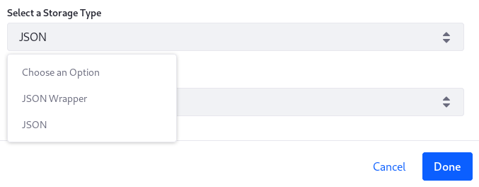
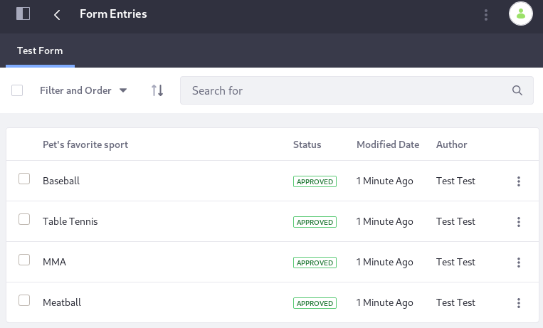

# Writing a Form Storage Adapter

> Available: Liferay DXP 7.3 and Liferay DXP 7.2 versions that include the fix for [LPS-97208](https://issues.liferay.com/browse/LPS-97208) (planned for Liferay DXP 7.2 SP3).

By default, forms are stored as JSON in Liferay DXP's database. This example shows you how to implement a new storage adapter to inject custom logic into a form record persistence event.



First you'll see how the [default storage adapter](https://github.com/liferay/liferay-portal/blob/[$LIFERAY_LEARN_DXP_VERSION$]/modules/apps/dynamic-data-mapping/dynamic-data-mapping-service/src/main/java/com/liferay/dynamic/data/mapping/internal/storage/DDMJSONStorageAdapter.java) saves form records in the Liferay DXP database as JSON content. Then you'll add logic to store each Form Record on the file system.

## Examine a Running DDM Storage Adapter

To see how storage adapters work, deploy an example and then add some form data using the example adapter.

### Deploy the Example

1. Start Liferay DXP. If you don't already have a docker container, use

    ```bash
    docker run -it -p 8080:8080 liferay/portal:[$LIFERAY_LEARN_DXP_VERSION$]
    ```

    If you already have a docker container, use

    ```bash
    docker start -i [container_name]
    ```

1. Download and unzip [the DDM Storage Adapter project](./writing-a-form-storage-adapter/liferay-r2f1.zip).

    ```bash
    curl https://learn.liferay.com/dxp/7.x/en/process-automation/forms/developer-guide/liferay-r2f1.zip -O
    ```

    ```bash
    unzip liferay-r2f1.zip
    ```

1. From the module root, build and deploy.

    ```bash
    ./gradlew deploy -Ddeploy.docker.container.id=$(docker ps -lq)
    ```

    ```tip::
       This command is the same as copying the deployed jars to /opt/liferay/osgi/modules on the Docker container.
    ```

1. Confirm the deployment in the Liferay Docker container console.

    ```bash
    STARTED com.acme.r2f1.impl_1.0.0 [1009]
    ```

### Use the Deployed Storage Adapter

1. Open your browser to <http://localhost:8080>.

1. Go to the Forms application in _Site Menu_ &rarr; _Content & Data_ &rarr; _Forms_.

1. Click the *Add* button () to open the Form Builder.

1. In the Form Builder view, click the *Options* button () and open the *Settings* window.

1. Under *Select a Storage Type*, choose the JSON Wrapper type and click _Done_.

1. Add a [Text Field](./../user-guide/creating-forms.md) to the form, publish the form, and submit it a few times.

1. To verify the form data were persisted, go to the Form's Records:

   From _Site Menu_ &rarr; _Content_ &rarr; _Forms_, click the Form's *Actions* button (), then _View Entries_.

   

1. Additionally, logging is provided in each CRUD method to demonstrate that the sample's methods are being invoked.

   ```bash
   2020-08-18 22:19:48.693 WARN  [http-nio-8080-exec-2][R2F1DDMStorageAdapter:103] Acme storage adapter's save method was invoked
   ```

## Understand the Extension Point

The example contains only one class: `R2F1DDMStorageAdapter`, a service implementing a `DDMStorageAdapter` to provide logic for storing Form Entries. The deployed example currently just wraps the default JSON implementation: `DDMJSONStorageAdapter`. Later, you'll add file system storage to the code that's already here.

### Register the Adapter Class with the OSGi Container

The `DDMFileSystemStorageAdapter` implements the `DDMStorageAdapter` interface, but must be registered as an OSGi service:

```java
@Component(
	immediate = true, property = "ddm.storage.adapter.type=r2f1-ddm-storage-adapter",
	service = DDMStorageAdapter.class
)
public class R2F1StorageAdapter implements DDMStorageAdapter {
```

```note::
   The ``r2f1-ddm-storage-adapter`` key is localized into the value `R2F1 Dynamic Data Mapping Storage Adapter` by the ``src/main/resources/content/Language.properties`` file and the ``Provide-Capability`` header in the ``bnd.bnd`` file.
```

The `service` component property registers your implementation as a `DDMStorageAdapter` service.

The property `ddm.storage.adapter.type` provides an identifier so that your service is registered as a unique `DDMStorageAdapter` implementation. Other services can now reference it like this:

```java
@Reference(target = "(ddm.storage.adapter.type=r2f1-ddm-storage-adapter)")
private DDMStorageAdapter jsonWrapperDDMStorageAdapter;
```

### Understand the DDMStorageAdapter Interface

The interface requires three methods to handle CRUD operations on form records: `delete`, `get`, and `save` (which also handles update logic).

```java
public DDMStorageAdapterDeleteResponse delete(
        DDMStorageAdapterDeleteRequest ddmStorageAdapterDeleteRequest)
    throws StorageException;
```

```java
public DDMStorageAdapterGetResponse get(
        DDMStorageAdapterGetRequest ddmStorageAdapterGetRequest)
    throws StorageException;
```

```java
public DDMStorageAdapterSaveResponse save(
        DDMStorageAdapterSaveRequest ddmStorageAdapterSaveRequest)
    throws StorageException;
```

Each method must return a _DDMStorageAdapter[[Save](https://github.com/liferay/liferay-portal/blob/[$LIFERAY_LEARN_DXP_VERSION$]/modules/apps/dynamic-data-mapping/dynamic-data-mapping-api/src/main/java/com/liferay/dynamic/data/mapping/storage/DDMStorageAdapterSaveResponse.java)/[Get](https://github.com/liferay/liferay-portal/blob/[$LIFERAY_LEARN_DXP_VERSION$]/modules/apps/dynamic-data-mapping/dynamic-data-mapping-api/src/main/java/com/liferay/dynamic/data/mapping/storage/DDMStorageAdapterGetResponse.java)/[Delete](https://github.com/liferay/liferay-portal/blob/[$LIFERAY_LEARN_DXP_VERSION$]/modules/apps/dynamic-data-mapping/dynamic-data-mapping-api/src/main/java/com/liferay/dynamic/data/mapping/storage/DDMStorageAdapterDeleteSaveResponse.java)]Response_ object, constructed using a static inner `Builder` class's `newBuilder` method.

All methods are passed a `DDMStorageAdapter[Save/Delete/Get]Request`. The request objects contain getter methods that return useful contextual information.

## Implement File System Storage

The example already overrides the necessary methods. You'll create private utility methods for your functionality and then call them from the overridden methods.

### Declare the Service Dependencies

This code relies on two services deployed to an OSGi container. Add these declarations at the end of the class using Declarative Services `@Reference` annotations, provided by `org.osgi.service.component.annotations.Reference`.

```java
@Reference
private DDMContentLocalService _ddmContentLocalService;

@Reference
private DDMFormValuesSerializerTracker _ddmFormValuesSerializerTracker;
```

### Create a Logger

Create a logger for the class and set it in a `_log` variable:

```java
private static final Log _log = LogFactoryUtil.getLog(
    R2F1DDMStorageAdapter.class);
```

This will be used to add some log messages each time one of the CRUD methods is invoked.

### Implement File Deletion

1. Set a private variable `_PATHNAME` so you can control where the files are stored. The path here points to the Liferay install location in the Docker container.

   ```java
   private static final String _PATHNAME = "/opt/liferay/form-records";
   ```

1. Create a `_deleteFile` utility method (import the `java.io.File` class):

   ```java
   private void _deleteFile(long fileId) {
       File file = new File(_PATHNAME + "/" + fileId);

       file.delete();

       if (_log.isWarnEnabled()) {
        _log.warn("Deleted file with the ID " + fileId);
       }
   }
   ```

1. Find the overridden `delete` method. Immediately before the `return` statement, add

   ```java
    long fileId = ddmStorageAdapterDeleteRequest.getPrimaryKey();

    _deleteFile(fileId);
   ```

Now the code first deletes the file from the file system before it deletes the copy in the database.

### Implement File Retrieval

You'll follow the same procedure for the `get` method: create a private utility method and then call it.

1. Add the `_getFile` utility method:

   ```java
	private void _getFile(long fileId) throws IOException {
		try {
			if (_log.isWarnEnabled()) {
				_log.warn(
					"Reading the file with the ID " + fileId + ": " +
						FileUtil.read(_PATHNAME + "/" + fileId));
			}
		}
		catch (IOException e) {
			throw new IOException(e);
		}
	}
    ```

   Import `com.liferay.portal.kernel.FileUtil` and `java.io.IOException`.

1. In the overridden `get` method (inside the `try` block), insert the following immediately before the `return` statement, setting the `storageId` (retrieved by `ddmStorageAdapterGetRequest.getPrimaryKey()`) as the `fileId` and calling the `_getFile` utility method which prints the retrieved content to the Liferay log.

   ```java
   long fileId = ddmStorageAdapterGetRequest.getPrimaryKey();

   _getFile(fileId);
   ```

### Implement File Creation Logic

There are two types of save requests: 1) a new record is added or 2) an existing record is updated. At each save, you'll have the `update` method overwrite the existing file, using the current `ddmFormValues` content.

1. Create a `_saveFile` utility method:

   ```java
   private void _saveFile(long fileId, DDMFormValues formValues)
       throws IOException {

       try {
           String serializedDDMFormValues = _serialize(formValues);

           File abstractFile = new File(String.valueOf(fileId));

           FileUtil.write(
               _PATHNAME, abstractFile.getName(), serializedDDMFormValues);

           if (_log.isWarnEnabled()) {
               _log.warn("Saved a file with the ID" + fileId);
           }
       }
       catch (IOException e) {
           throw new IOException(e);
       }
   }
    ```

   Import `com.liferay.dynamic.data.mapping.storage.DDMFormValues`.

1. Create a `_serialize` utility method to convert the `DDMFormValues` object to JSON:

    ```java
	private String _serialize(DDMFormValues ddmFormValues) {
		DDMFormValuesSerializer ddmFormValuesSerializer =
			_ddmFormValuesSerializerTracker.getDDMFormValuesSerializer("json");

		DDMFormValuesSerializerSerializeRequest.Builder builder =
			DDMFormValuesSerializerSerializeRequest.Builder.newBuilder(
				ddmFormValues);

		DDMFormValuesSerializerSerializeResponse
			ddmFormValuesSerializerSerializeResponse =
				ddmFormValuesSerializer.serialize(builder.build());

		return ddmFormValuesSerializerSerializeResponse.getContent();
	}
    ```

1. Add this logic and the call to `_saveFile` to the `save` method by replacing the existing `return` statement:

   ```java
    DDMStorageAdapterSaveResponse jsonStorageAdapterSaveResponse =
        _jsonStorageAdapter.save(ddmStorageAdapterSaveRequest);

    long fileId = jsonStorageAdapterSaveResponse.getPrimaryKey();

    _saveFile(fileId, ddmStorageAdapterSaveRequest.getDDMFormValues());

    return jsonStorageAdapterSaveResponse;
   ```

   The `_jsonStorageAdapter.save` call is made first, so that a Primary Key is created for a new form entry. This Primary Key is retrieved from the `Response` object to create the `fielId`.

## Deploy and Test the Storage Adapter

Use the same `deploy` command as earlier to deploy the Storage Adapter. From the module root run

```bash
./gradlew deploy -Ddeploy.docker.container.id=$(docker ps -lq)
```

Now verify that it's working:

1. Go to the Forms application in _Site Menu_ &rarr; _Content_ &rarr; _Forms_.

1. Click the *Add* button  to open the Form Builder.

1. In the Form Builder view, click the *Options* button () and open the *Settings* window.

1. From the select list field called *Select a Storage Type*, choose the File System type and click _Done_.

1. Add a [Text Field](./../user-guide/creating-forms.md) to the form, publish the form, and submit it a few times.

1. To verify the form records were written to the container's file system, check the log. You'll see messages like: 

   ```bash
   2020-08-18 22:19:48.693 WARN  [http-nio-8080-exec-2][R2F1DDMStorageAdapter:103] Saved a file with the ID 36242
   2020-08-18 22:19:48.716 WARN  [http-nio-8080-exec-2][R2F1DDMStorageAdapter:122] Reading the file with the ID 36242: {"availableLanguageIds":["en_US"],"defaultLanguageId":"en_US","fieldValues":[{"instanceId":"62fQx5qI","name":"PetsFavoriteVehicle","value":{"en_US":"stretch limousine"}}]}
   ```

## Conclusion

By implementing a `DDMStorageAdapter`, you can save forms records in any storage format you want.
