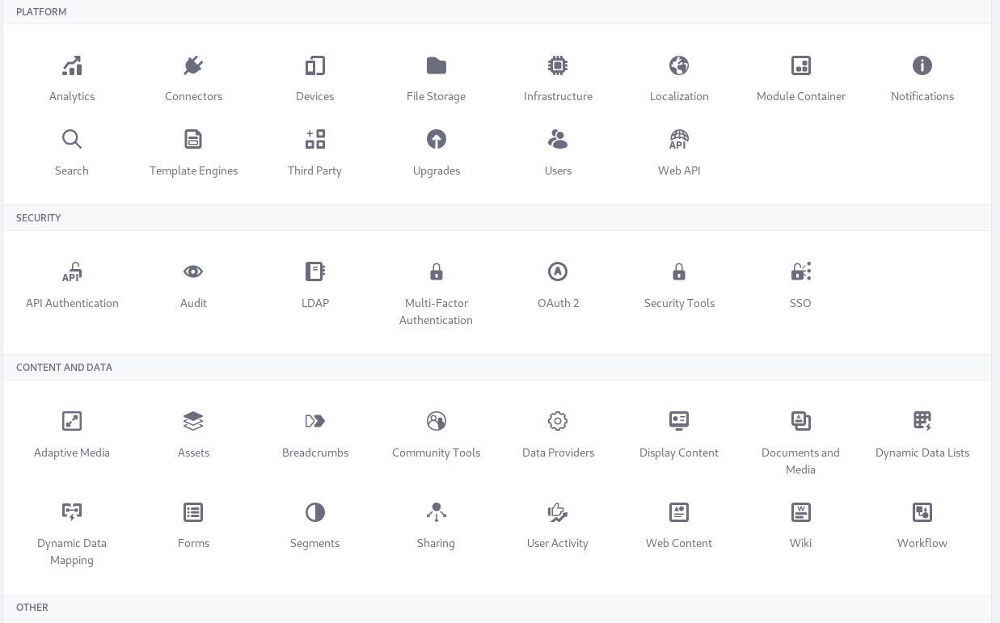
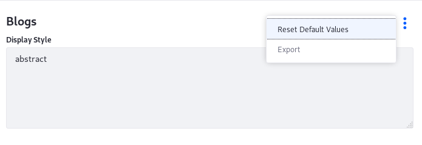

# System Settings

The System Settings application in Liferay DXP serves as the centralized location for System Scoped configurations. Open it from Control Panel &rarr; Configuration &rarr; System Settings.

System Settings is organized into sections (for example, Content and Data) and categories (for example, Workflow) based on the functionality being configured. There's also a Search bar to make finding configuration entries easier. Search for the name of a specific configuration entry, or even a specific field within an entry.


Navigate to the configuration you need by finding a section (e.g., Content and Data) of interest, then browse its categories (e.g., Workflow).


If you can't locate a System Settings entry by browsing, search for it using the search bar.


```note::
   Some system-scoped configurations can be made in properties files and in the Server Administration application in the Control Panel.
```

Liferay DXP is composed of many applications. The applications and their services may be configurable at several [scopes](./system-settings-configuration-scope.md), as defined by the application's developers. Any configuration made in System Settings serves for making system scoped configuration changes or setting system-wide default configurations that can be overridden at another scope.

If you aren't sure what a configuration option does, check the documentation for the feature you're interested in. 

## Editing System Configurations

Once you find the configuration to modify,

1. Open the configuration form for the entry.

1. Make any changes you'd like, then click *Save*. Your configuration changes are saved and applied throughout the system. 

    ```important::
       Content generated using templates (e.g., FreeMarker templates and Application Display Templates) is cached. Cached content might not reflect configuration changes until the cache is invalidated (cleared). The Server Administration &rarr; Resources tab provides cache clearing options.
    ```

## Resetting a System Settings Entry

If you make some regrettable configuration decisions and can't recall exactly what you did, start over by clicking the actions button (), then clicking *Reset Default Values*. 



## Exporting and Deploying Configurations

System Settings are portable. To apply the same configurations in another installation, you don't need to remember and duplicate every configuration change you made. The System Settings application lets you export configurations; either a single configuration entry or all the entries that you changed. The exported files are deployable to any Liferay DXP installation of the same version.

To export a single entry's configurations, click the actions button (), then click *Export*. A `.config` file containing your configuration downloads to your system.

To export all the configuration changes you've made in System Settings, click the System Settings options button (), then click *Export All Settings*. The `.config` files for all the entries you edited then download in a ZIP file. 

To make these configurations active in the destination system, unzip and place the `.config` files in the `[Liferay_Home]/osgi/configs` folder. 
