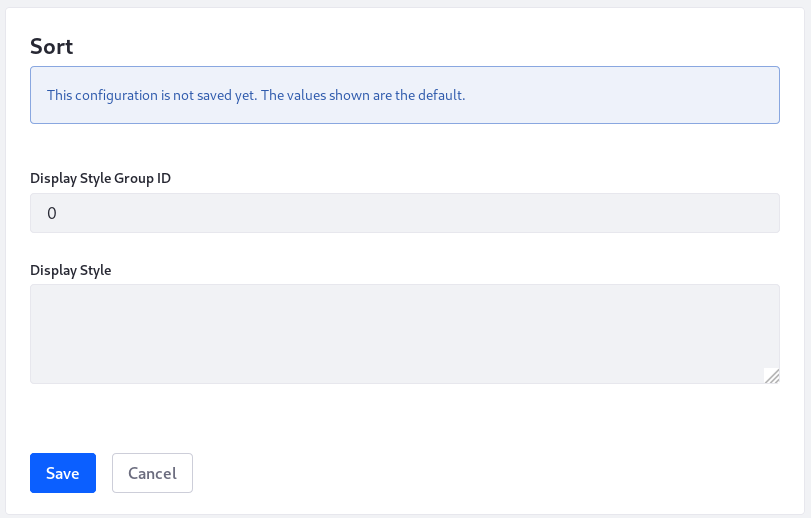

# Configuring Search: Widget Scope

Several search widgets are available to place on Pages. Each one has its own configuration options:

**Search Results**: Configure how search results are displayed. Read [here](https://help.liferay.com/hc/en-us/articles/360029133971-Search-Results) for more information.

**Search Bar**: Configure the behavior of how search keywords are processed. See [here](https://help.liferay.com/hc/en-us/articles/360029133811-Searching-for-Assets#search-bar) for more information.

**Search Facets**: Configure each facet's behavior and URL parameters. See [here](https://help.liferay.com/hc/en-us/articles/360029133851-Facets) for more information.

**Search Options**: This is a special case, where configuring this widget defines page scoped behavior. Add the Search Option widget to a page and define two booleans for the Search Page:

* Allow Empty Searches: By default, failure to enter a keyword returns no results. Enabling this ensure that _all_ results are returned when no keyword is entered in the Search Bar.
* Basic Facet Selection: By default, facet counts are recalculated after each facet selection. Enable this to turn off facet recounting.

**Search Suggestions**: Suggest better queries and spell check queries. See [here](https://help.liferay.com/hc/en-us/articles/360029133811-Searching-for-Assets#search-suggestions) for more information.

**Search Insights**: Add this to the Search Page to inspect the full query string that's constructed by the back-end search code when the User enters a keyword. Only useful for testing and development. See [here](https://help.liferay.com/hc/en-us/articles/360028721312-Search-Insights) for more information.

**Custom Filter**: Add a widget to the page for each of the filters you'd like applied to the search results. Let search page users see and manipulate the filters or make them invisible and/or immutable. See [here](https://help.liferay.com/hc/en-us/articles/360028721272-Filtering-Search-Results-with-the-Custom-Filter-Widget) for more information.

**Sort**: Let Users reorder the search results based on the value of certain `keyword` fields in the index. For example, show results in alphabetic order of the Title field. The default order is determined by the search engine's _Relevance_ calculation. See [here](https://help.liferay.com/hc/en-us/articles/360029041691-Sorting-Search-Results-with-the-Sort-Widget) for more information.

**Low Level Search Options:** Configure the search widgets to participate in a search that's aimed at an index other than the _Company Index_. The company index is where the Liferay DXP assets index their data, so many installations will not need this widget. See [here](https://help.liferay.com/hc/en-us/articles/360032607571-Low-Level-Search-Options-Searching-Additional-or-Alternate-Indexes) for more information.

**Similar Results:** Display similar search results to an asset being displayed on a page. Documentation will be available soon.

**X-Pack Monitoring:** Liferay Enterprise Search subscribers can access [Elastic's Kibana](https://www.elastic.co/kibana) monitoring tool inside a widget placed on a Liferay DXP Page.

## Setting System and Instance-Scoped Widget Defaults

Many Search widgets have System Settings/Instance Settings entries, where widget defaults can be set. These defaults are overridden in the individual widget's configuration. To understand whether to use System or Instance Settings for your default configurations, read the article on [configuration scope](../../system-administration/system-settings-and-configuration-scope.md).

Each of these configuration entries have 

**Display Style Group ID:** Enter the Site ID where the widget template is located. The default ones are all Global templates, so use *0* for the ID.

**Display Style:** The widget template's key. For example, setting `CATEGORY-FACET-CLOUD-FTL` in the Category Facet's System Settings entry sets the Cloud Layout template as the system scoped default for the Category Facet Widget.

> To find the template keys available to enter in the Display Style field, go to the Site Selector and choose the Global scope. From there open the Site Menu &rarr; Site Builder &rarr; Widget Templates. Click into a template to find its template key.

System and Instance configuration entries for setting the default Widget Template are available for these widgets:

- Similar Results Configuration
- Category Facet
- Custom Facet
- Custom Filter
- Folder Facet
- Modified Facet
- Search Bar
- Search Results
- Site Facet
- Sort
- Tag Facet
- Type Facet
- User Facet

