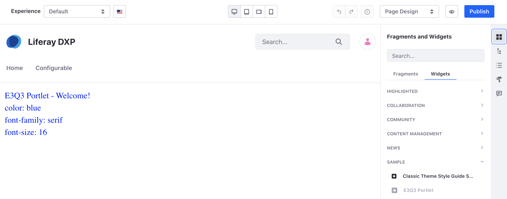
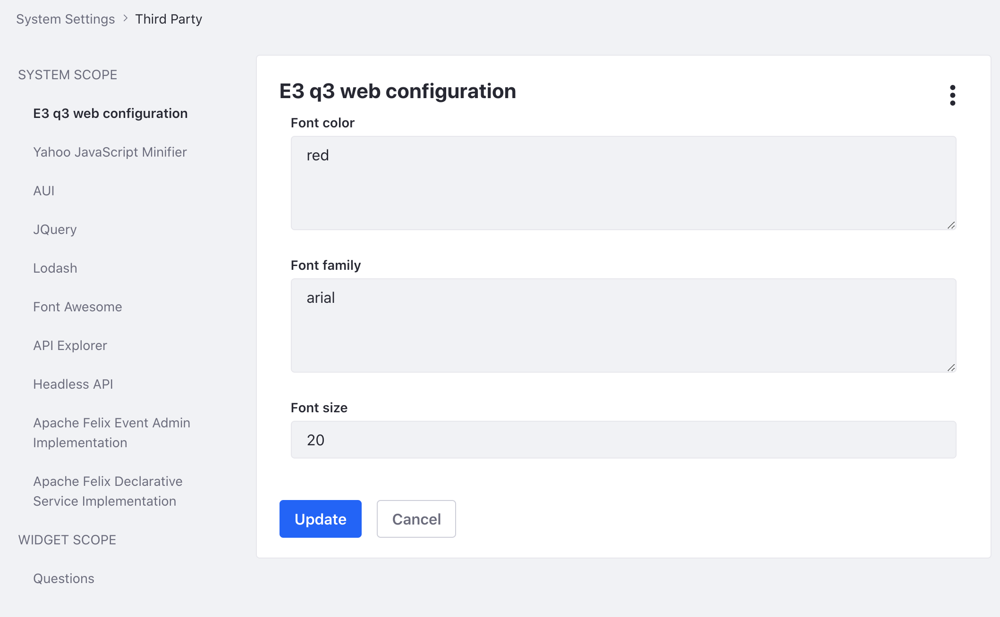

# Setting and Accessing Configurations

Liferay's configuration framework provides a simple method to be able to add a configuration UI to an application. 

## See Sample Code for a MVC Portlet

1. Start Liferay DXP. If you don't already have a docker container, use

    ```bash
    docker run -it -p 8080:8080 [$LIFERAY_LEARN_DXP_DOCKER_IMAGE$]
    ```
1. Download and unzip [Setting and Accessing Configurations](./liferay-e3q3.zip).

    ```bash
    curl https://learn.liferay.com/dxp/latest/en/developing-applications/core-frameworks/configurable-application/liferay-e3q3.zip -O
    ```

    ```bash
    unzip liferay-e3q3.zip
    ```

1. From the module root, build and deploy.

    ```bash
    ./gradlew deploy -Ddeploy.docker.container.id=$(docker ps -lq)
    ```

    ```note::
       This command is the same as copying the deployed jars to /opt/liferay/osgi/modules on the Docker container.
    ```

1. Confirm the deployment in the Liferay Docker container console.

    ```bash
    STARTED com.acme.e3q3.web.0.0 [1650]

1. Verify that the example module is working. Open your browser to `https://localhost:8080`

1. Add the E3Q3 Portlet to a page. You can find the example portlet under Sample Widgets.

    

    You should see a welcome message along with the 3 attributes that can be configured: font color, font family, and font size.

1. To change the configuration, navigate to *Control Panel* &rarr; *Configuration* &rarr; *System Settings*. Under *Platform* click *Third Party*. Click the name of the sample application on the left.

    

    Try a different font color, font family, and font size. Click the *Update* button and go back to your page with the published widget. Verify that the attributes have changed.

Now let's see how the sample code works.

## Creating a Configuration Interface

The first step is to create a configuration interface. Creating this interface adds the UI in *System Settings*. It also defines the attributes that are configurable.

