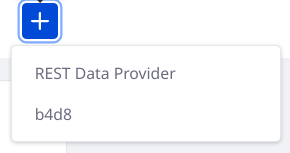
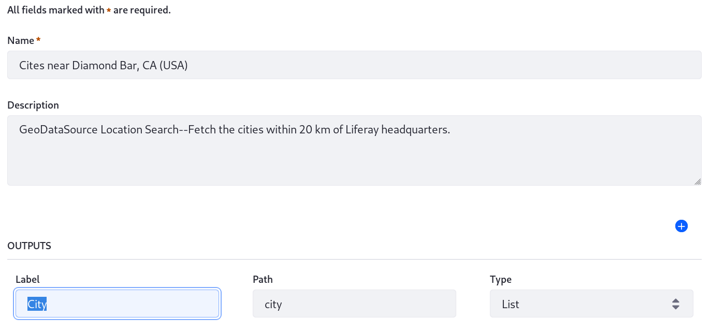
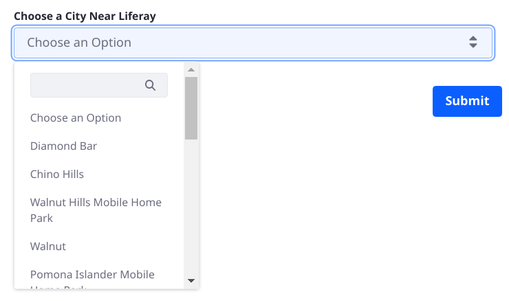
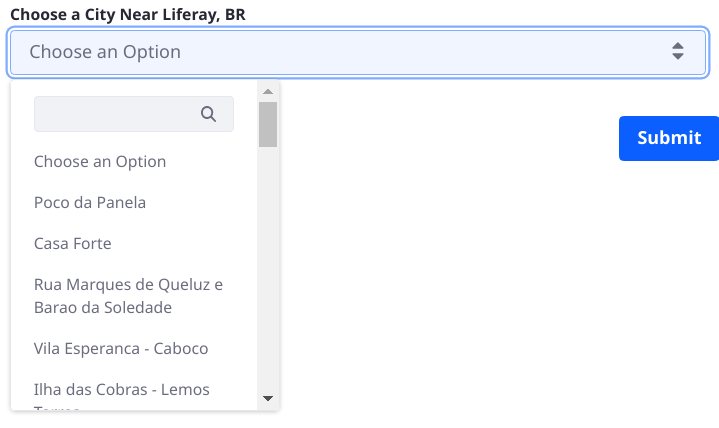

# Writing a Custom Data Provider

Liferay Forms fields can be populated using a [Data Provider](../data-providers/data-providers-overview.md). Out of the box, there's a REST Data Provider that provides a flexible way to consume data from most REST endpoints. See [Using the REST Data Provider to Populate Form Options](../data-providers/using-the-rest-data-provider-to-populate-form-options.md) to learn more.

If the out of the box data provider doesn't serve your purpose, use the `DDMDataProvider` extension point to create your own.

```note::
   The example Data Provider demonstrated here consumes data from the `GeoDataSource™ Location Search Web Service <https://www.geodatasource.com/web-service/location-search>`__. The API key of a Liferay employee is hard-coded into this sample; please do not overuse the sample. Never use it in production environments.
```

## Deploy a Custom Data Provider

1. Start Liferay.

   ```bash
   docker run -it -p 8080:8080 [$LIFERAY_LEARN_DXP_DOCKER_IMAGE$]
   ```

1. Download and unzip the Acme XML Data Provider.

   ```bash
   curl https://learn.liferay.com/dxp/7.x/en/process-automation/forms/developer-guide/liferay-b4d8.zip -O
   ```

   ```bash
   unzip liferay-b4d8.zip
   ```

1. From the module root, build and deploy.

   ```bash
   ./gradlew deploy -Ddeploy.docker.container.id=$(docker ps -lq)
   ```

      ```tip::
      This command is the same as copying the deployed jars to /opt/liferay/osgi/modules on the Docker container.
      ```

1. Confirm the deployment of each module in the Liferay Docker container console.

   ```bash
   STARTED com.acme.n4g6.impl_1.0.0
   ```

## Test the Data Provider

To use the data provider in a form,

1. Add an instance of the Data Provider:

   1. In the Site Menu, go to Content and Data &rarr; Forms. 

   1. Open the Data Providers tab and click the Add button.

      

   1. Configure it:
      - **Name:** Cites Near Diamond Bar, CA (USA)
      - **Description:** GeoDataSource Location Search--Fetch the cities within 20 km of Liferay headquarters.
      - **Outputs** 
         - **Label:** City
         - **Path:** city
         - **Type:** List

      

   1. Click *Save*.

1. Add a form that uses the Cities Near Diamond Bar data provider:

   1. In the Site Menu, go to Content and Data &rarr; Forms. 

   1. In the Forms tab, click the Add button.

   1. Add a Select from List fields with these settings:

      1. **Label:** Choose a City Near Liferay

      1. **Create List:** From Data Provider

      1. **Choose a Data Provider:** Cities Near Diamond Bar, CA (USA)

      1. **Choose an Output Parameter:** City

   1. Publish the form and verify that the list is populated from the data provider:

   
This is a nice example, but it hard codes the URL for the data provider. If you allow the URL to be configurable, you can use this same data provider for other cities, or any other URL that serves XML. 

## Add Data Provider Settings

To add Data Provider Settings, edit the `DataProviderSettings` and the `DataProvider`. 

### Add a URL Field to the Settings

1. First add the new `URL` field to the `DataProviderSettings`. In the class body, put the annotated method

    ```java
    @DDMFormField(
        label = "%url", required = true,
        validationErrorMessage = "%please-enter-a-valid-url",
        validationExpression = "isURL(url)"
    )
    public String url();
    ```

    It requires this import:

    ```java
    import com.liferay.dynamic.data.mapping.annotations.DDMFormField;
    ```

1. In the class-level annotation that creates the form layout, replace the `@DDMFormLayoutColumn` with

    ```java
    @DDMFormLayoutColumn(
        size = 12, value = {"url", "outputParameters"}
    )
    ```

Now the settings are ready to be used in the `DataProvider` class. 

### Update the Data Provider

Now you need a few updates to the `DataProvider` class: 

- Validate that a valid URL is passed
- Instantiate a `DataProviderSettings` object
- Set the URL into the response

1. To make sure you get a valid URL, now that user input is allowed:

    Remove the line defining the `key` variable--this is now configurable in the URL setting field.

    ```java
    String key = "LAOOBDZVQ5Z9HHYC4OCXHTGZGQLENMNA";
    ```

1. Replace the `String` variable defining the URL with `Http.Options` populated by the data provider setting field.

    Import Lifery's `Http` class.

    ```java
    import com.liferay.portal.kernel.util.Http;
    ```

    ```java
    Http.Options options = new Http.Options();

    options.setLocation(_b4d8DataProviderSettings.url()));
    ```

1. Use the new `options` in place of `url` in the return statement's call to `_createdDDMDataProviderResponse`. Replace the existing return statement.

    ```java
    return _createDDMDataProviderResponse(
        b4d8DDMDataProviderSettings,
        _toDocument(HttpUtil.URLtoString(options)));
    ```


Feel free to copy in this new `try` block in the `getData` method, instead of making the above replacements one by one:

```java
try {
    B4D8DDMDataProviderSettings b4d8DDMDataProviderSettings =
        _ddmDataProviderInstanceSettings.getSettings(
            _getDDMDataProviderInstance(
                ddmDataProviderRequest.getDDMDataProviderId()),
            B4D8DDMDataProviderSettings.class);

    Http.Options options = new Http.Options();

    options.setLocation(b4d8DDMDataProviderSettings.url());

    return _createDDMDataProviderResponse(
        b4d8DDMDataProviderSettings,
        _toDocument(HttpUtil.URLtoString(options)));
}
```

## Deploy and Test the Data Provider

To use the data provider in a form,

1. From the module root, rebuild and redeploy.

   ```bash
   ./gradlew deploy -Ddeploy.docker.container.id=$(docker ps -lq)
   ```

<!-- -8.0342896,-34.9239708 -->
1. Add an instance of the Data Provider:
      - **Name:** Cites Near Recife, Pernambuco (Brazil)
      - **Description:** GeoDataSource Location Search--Fetch the cities within 20 km of Liferay's Brazil office.
      - **URL:** 
        ```
        https://api.geodatasource.com/cities?key=LAOOBDZVQ5Z9HHYC4OCXHTGZGQLENMNA&format=xml&lat=-8.0342896&lng=-34.9239708
        ```
      - **Outputs** 
         - **Label:** City
         - **Path:** city
         - **Type:** List

1. Add a form that uses the Cities Near Recife data provider:

   1. In the Site Menu, go to Content and Data &rarr; Forms. 

   1. In the Forms tab, click the Add button.

   1. Add a Select from List fields with these settings:

      1. **Label:** Choose a City Near Liferay, BR

      1. **Create List:** From Data Provider

      1. **Choose a Data Provider:** Cities Near Recife, Pernambuco, (Brazil)

      1. **Choose an Output Parameter:** City

   1. Publish the form and verify that the list is populated from the data provider:

   
